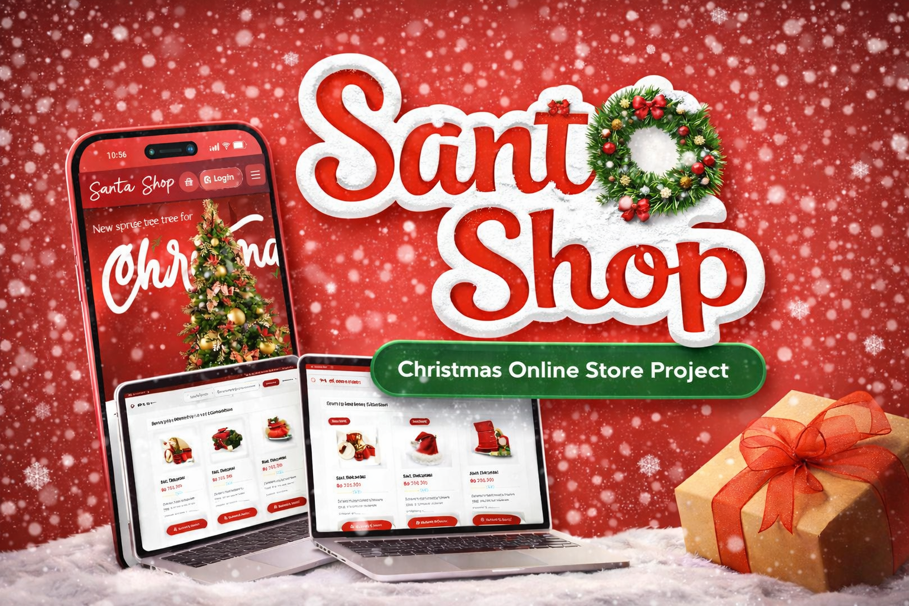

# 🎄 Santa Shop — Christmas Online Store

---

## ✨ Deskripsi

**Santa Shop** adalah website e-commerce bertema Natal yang modern, interaktif, dan responsif.  
Website ini dirancang untuk memberikan pengalaman belanja yang menyenangkan dengan nuansa festive 🎁🎅.

Project ini menggabungkan desain UI/UX modern dengan interaksi dinamis menggunakan JavaScript murni (Vanilla JS).

---

## 🚀 Fitur Utama

### 🏠 1. Homepage
- Hero section dengan efek salju ❄️
- Banner Natal interaktif
- Navbar modern (Search, Cart, Login)
- Smooth scroll & animation

### 🛍️ 2. Produk
- Grid produk responsif
- Live search 🔍
- Filter kategori
- Badge produk:
  - Best Seller
  - Terlaris
  - Premium
  - Baru

### 🛒 3. Keranjang Belanja (Cart)
- Tambah produk
- Hapus produk
- Update jumlah barang (+ / -)
- Perhitungan total otomatis
- Modal popup interaktif

### 💳 4. Checkout System
- Multi-step checkout:
  1. Alamat
  2. Pembayaran
  3. Konfirmasi
- Metode pembayaran:
  - Bank Transfer
  - QRIS
- Ringkasan pesanan (Order Summary)

### 📦 5. Tracking Pesanan
- Input nomor order
- Timeline status:
  - Diproses
  - Dikirim
  - Selesai

### 🎁 6. Gift System
- Kirim hadiah ke orang lain
- Form pengirim & penerima
- Pesan personal 🎄

### 📍 7. Lokasi Toko
- Informasi cabang
- UI card modern
- Mudah diperluas ke Google Maps

### ⭐ 8. Review System
- Tambah ulasan
- Rating bintang interaktif ⭐⭐⭐⭐⭐
- Tampilan review modern

### 🔊 9. Audio & Animasi
- Background music 🎵
- Toggle audio button
- Snow animation (canvas)
- Scroll reveal animation

---

## 🛠️ Teknologi yang Digunakan

| Teknologi              | Keterangan       |
|----------------------|----------------|
| HTML5                | Struktur website |
| CSS3                 | Styling & layout |
| JavaScript (Vanilla) | Interaktivitas |
| Remix Icon           | Icon modern |
| Google Fonts (Poppins) | Typography |

---

## 📱 Responsive Design

Website ini fully responsive dan mendukung:

- 📱 Mobile
- 📲 Tablet
- 💻 Desktop

---

